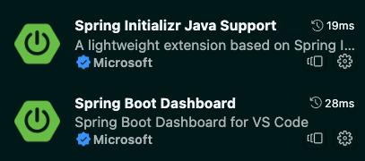
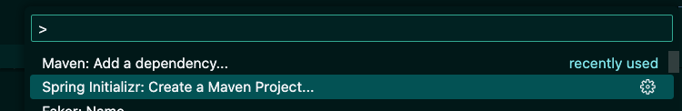

# Primeira Parte do Café com Java ☕️

Extensões sugeridas para facilitar a vida com Spring no VsCode:



---
### Para Rodar ☕️

Utilize o `Spring Dashboard` ou execute pelo maven no terminal com o comando:
```bash
mvn spring-boot:run
```

A porta padrão da aplicação é 8080.

Para alterar basta adicionar no arquivo `application.properties` o valor:

server.port=3000

ou qualquer outra porta desejada.

---

### Para começar do Zero ☕️


Após `cmd + shift + p` e selecione o Spring Initializr



Crie o projeto e instale as dependêncas:

- Spring Web
- Spring Data JPA
- Spring Boot DevTools
- MySQL Driver
- Validation I/O

Antes de executar o projeto com a extensão Spring Dashboard ou pelo maven no terminal usando o comando `mvn spring-boot:run`, garanta o start do banco mysql.

Sugestão: Utilizar Docker 🐳

```bash
  docker run -dit --name mysqlspring -e MYSQL_ROOT_PASSWORD=root -e MYSQL_DATABASE=courses_db -p 3306:3306 mysql:8
```

Após isso, configure o arquivo `application.properties` da seguinte maneira:

```
spring.datasource.url=jdbc:mysql://localhost:3306/courses_db
spring.datasource.username=root
spring.datasource.password=root
spring.datasource.driver-class-name=com.mysql.cj.jdbc.Driver

spring.jpa.hibernate.ddl-auto=update
```

A linha `spring.jpa.hibernate.ddl-auto=update` garante a criação e atualização das tabelas no banco de dados.

Agora sim! Tudo pronto para rodar e iniciar a construção de seu projeto.

